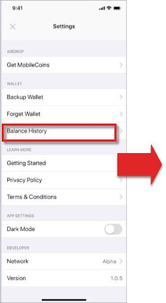

# Check Transaction Status (for Sender)

Senders can check their transaction status on their smartphone’s MobileCoin wallet app by looking up their balance history in their Settings:

 

As an iOS/SWIFT developer, you will need the following code to enable the user to check their transaction status:

```SWIFT
let status = accountOps.status(
account: account,
transaction: transaction)
```

**NOTE**: The code provided by the MobileCoin SDK enables the users to access a secure, pre-processed version of their data on the MobileCoin Ledger in MobileCoin Fog Services through their mobile wallet app.
