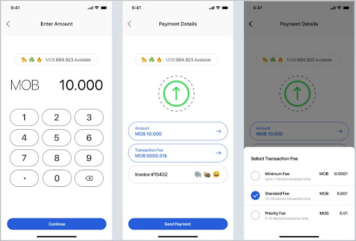

# Calculate fee

### User experience

In order for users to send transactions, users must pay the **transaction fee**:



### Implementation

As an iOS/SWIFT developer, you will need the following code enable the user to be charged a transaction fee:

```swift
do {
let fee = try accountOps.calculateFee(
account: account,
amount: amount)
} catch {
  accountOps.defragmentAccount(account)
}
```


The code provided by the MobileCoin Wallet SDK enables the users to select a transaction fee based on the number of seconds they are willing to wait for their transaction to be sent.

