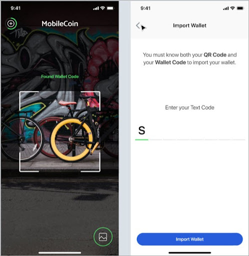
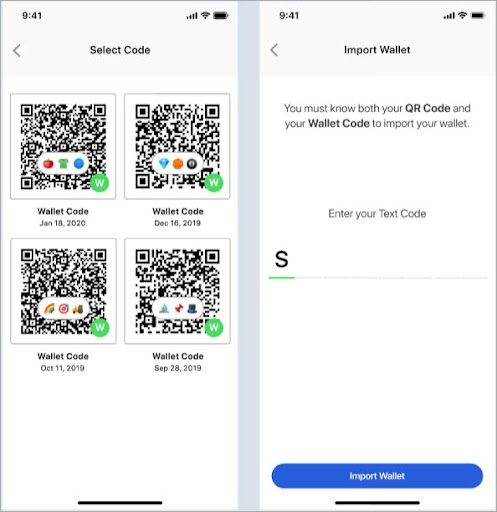

# Create an account key

### User experience

In order for new users to create a MobileCoin wallet on their smartphone, they must add an [**account key**](../glossary.md) by importing an account or scan a QR Code from their camera’s library.





### Implementation

As an iOS/SWIFT developer, you need the following code to enable the user to create/import the account key:

```
let rootEntropy = Data(/* bytes */)
let account = try Account(
rootEntropy: rootEntropy,
fogUrl: fogUrl)
```
