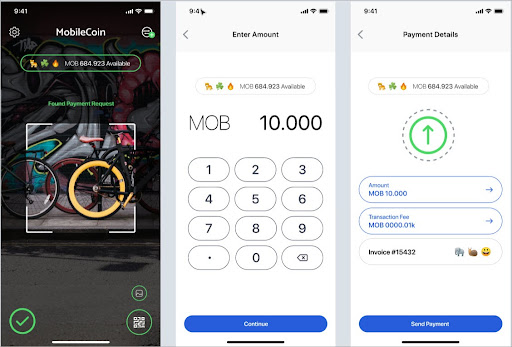

# Send transaction

### User experience

To send a transaction, users need to enter the transaction amount and send to a specific user’s public address or QR code. Users can also send a transaction to a public address that's already in their contacts.



### Implementation

As an iOS/SWIFT developer, you will need the following code to enable the user to send transactions:

```
accountOps.prepareTransaction(
from: account,
to: recipient,
amount: amount,
fee: fee
) {
  let (transaction, transactionReceipt) =
try $0.get()
  accountOps.submitTransaction(
transaction) {
let success = try $0.get()
}
}
```
