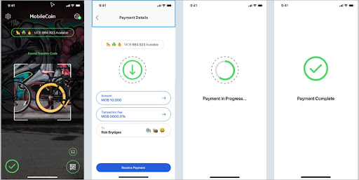

# Get Balance

In order for users to receive transactions (that is, get their balance), they must be able to deposit funds from a **transfer QR Code**.



As an iOS/SWIFT developer, you will need the following code to enable the user to get their balance:

```SWIFT
let accountOps = AccountOperations(
fogUrl: fogUrl,
consensusUrl: consensusUrl)
accountOps.updateBalance(
for: account
) {
let balance = try? $0.get()
}
```
