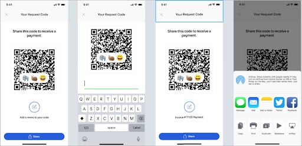

# Share public addresses

### User experience

Users can share **public addresses** from their MobileCoin wallet app with other individuals, and enable transactions to occur between the two users’ smartphones.

In order for new users to share their public addresses from their MobileCoin wallet on their smartphone, they must generate their request code after they enter the amount of a transaction to send.

**NOTE**: Users can share their public addresses without sending a transaction.



### Implementation

As an iOS/SWIFT developer, you will need the following code to enable the user to generate a request code:

```SWIFT
let bytes = account.publicAddress
.serializedProtoBytes
/* -------------------------- */
let recipient = PublicAddress(
serializedProtoBytes: bytes)
```
