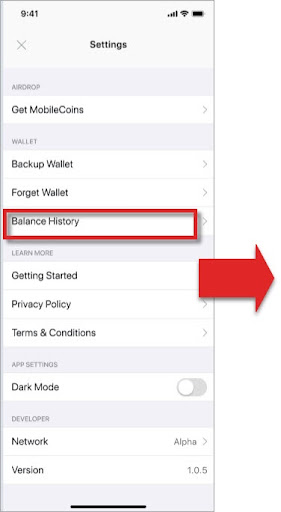
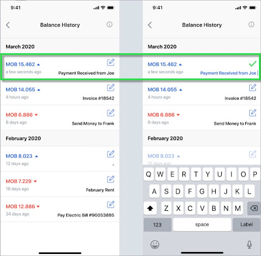

# Transaction receipts (for recipient)

### User experience

Similar to checking [transaction statuses](check-transaction-status.md), users can check the status of sent payments by looking up their balance history in their app's *Settings*:

 

### Implementation

As an iOS/SWIFT developer, you will need the following code to enable the user to check their recipients’ transaction statuses:

```SWIFT
let bytes = transactionReceipt
.serializedProtoBytes
/* ------------------------- */
let receipt = TransactionReceipt(
serializedProtoBytes: bytes)
let status = accountOps.status(
account: account,
transactionReceipt: receipt)
```
